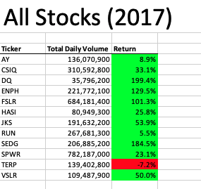
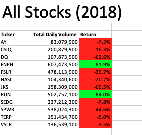

# Stock Analysis
---
### Automating the analysis of multiple renewable energy stocks using VBA

## Overview

This report will analyze the data for 2018 and 2017 of 12 renewable energy stocks including Atlantica Yield, Canadian Solar, Daqo New Energy Group, Enphase Energy, First Solar, Hannon Armstrong Inc., Jinko Solar, SunRun, SolarEdge, SunPower, Terraform Power, and Vivint Solar. The goal is to automate the formatting and analysis using VBA in order to output the yearly return and total volume for each stock. After creating the first draft of working code (Module 1: draftCode), I decided to refactor it to come up with a design pattern (Module 2: VBA_Challenge) with improved code performance that could be used on any stock data.

### Analysis

      Please, refer to the VBA_Challenge.xlsm in the repo specifically to the All Stocks Analysis worksheet. If you want to take a look to the entire code, open VBA and select the module called VBA_Challenge. There is only one Macro called "AllStockAnalysisRefactored".

I first created an array for all the stocks, so that each one of them could be addressed with an index.

Moreover, in order to come up with an automated analysis of the stocks I used a nested for loop that went through all the data, starting from the second row to the last one, storing the necessary information into arrays (total volume, first closing price, and last closing price) already initiated at the beginning of the macro.

### Results
---
 

As it can be seen just by glancing through the findings, the 2017 performance was considerably better as there is a lot more green to be seen in the table. This means there are more returns that came out positive. This is specially true for stocks such as Daqo, that in 2017 came out with a return of 199.4% and in 2018 of -62.6%. Similarly, this same happened for most of the stocks including Atlantica Yield (ticker: AY), Canadian Solar (CSIQ), First Solar (FSLR), Hannon Armstrong Inc. (HASI), Jinko Solar (JKS), SolarEdge (SEDG), SunPower (SPWR), and Vivint Solar (VSLR).

In conclusion, even though the vast majority of them performed well in 2017, most of them performed poorly in 2018. Definitely, the top picks would have been Enphase Energy (ENPH) or SunrRun (RUN), which were the only green energy stocks that gave high returns for both consecutive years. The best investment would have been to buy a lot of ENPH stock at the beginning of 2017 and hold it through 2018 as it had 129.5% and 81.9% return, respectively. Nevertheless, money could also have been made by buying a put option on TERP at the beginning of 2017 as it returned -7.2% and then in 2018 another -5%.

### Summary
---

Refactoring code has its pros and cons. Just like proofreading, going back and reevaluating what we wrote is a key step for better results. One pro would be that it makes the script easier to understand. A clean code is more versatile which is a huge advantage as code is always shared. On the other hand, the disadvantages behind refactoring revolve around the fact that it is just time consuming. Some people even argue that it is useless, as you are working on a body of code that already works and gets the job done.

In this project, this could be easily seen as the code performance and execution times relatively got better. Refactoring the code that did the analysis of the stocks definitely made the script more coherent. Now, I didn't have the iterations in different for loops or the formatting in another subroutine. Instead, I could just run the refactored macro and everything would be done at once. Even though the advantages were many, it took me a lot of time to come up with the refactored version of the code. I needed one single nested for loop to do the job and store the data I needed into arrays rather than simple variables. But even though it was time consuming, I believe it was worthwhile as now I have a body of clean code that I can easily edit in order to analyze different stock data. The goal should be to always strive to create a design pattern that is versatile, clean, easy to understand and shareable.

In conclusion, the original script had the advantage that if the code was wrong at any point, it would only affect that macro and function. The others would still work. Meanwhile, the disadvantages were that it was a very long and all-over-the-place script. On the other hand, the advantage of the refactored script was that it was more efficient and organized, making the execution times a lot shorter and the script easier to follow.
